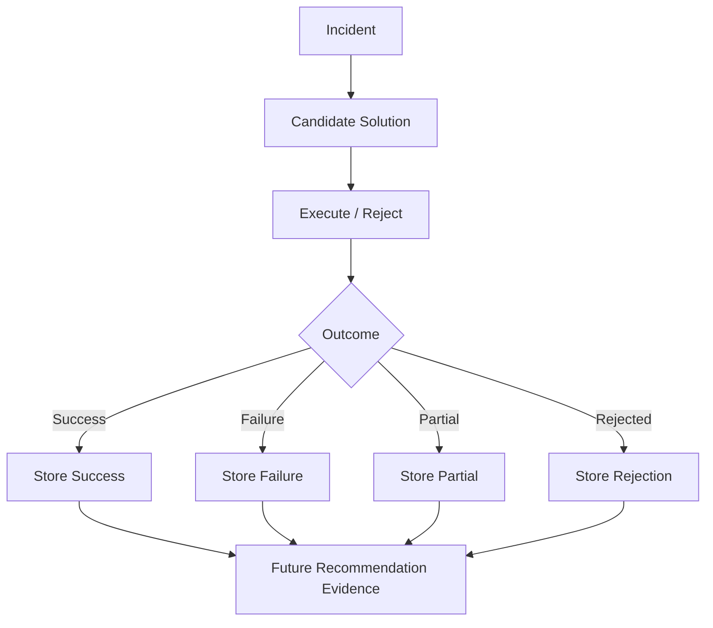

# Memory Architecture — IncidentMind

**Version:** 1.1 | **Status:** Updated

## Core Principle

> Memory is a record of experience—including what worked, what failed, what was rejected, and what remains uncertain.

## Outcome-Aware Memory

Every attempted solution becomes evidence.



## Retrieval Strategy
1. Generate the new incident embedding.
2. Vector-search CockroachDB.
3. Retrieve similar incidents.
4. Collect their solution attempts.
5. Evaluate outcomes.
6. Rank candidates.
7. Give evidence to the AI.
8. Generate the recommendation.

### Conceptual Ranking

```text
Recommendation Score =
  Semantic Similarity
+ Historical Success Evidence
+ Context Match
+ Confidence
+ Reward
- Failure Evidence
- Risk
```

## Outcome Rules
- **Success:** increase positive evidence.
- **Failure:** decrease recommendation priority but preserve the record.
- **Partial:** retain as conditional evidence.
- **Rejected:** record consideration, not technical failure.
- **Unknown:** do not treat as strong evidence.

## Memory Rules
- Never delete failed attempts merely because they failed.
- Never overwrite historical outcomes.
- Create a new attempt for every execution.
- Preserve audit history.
