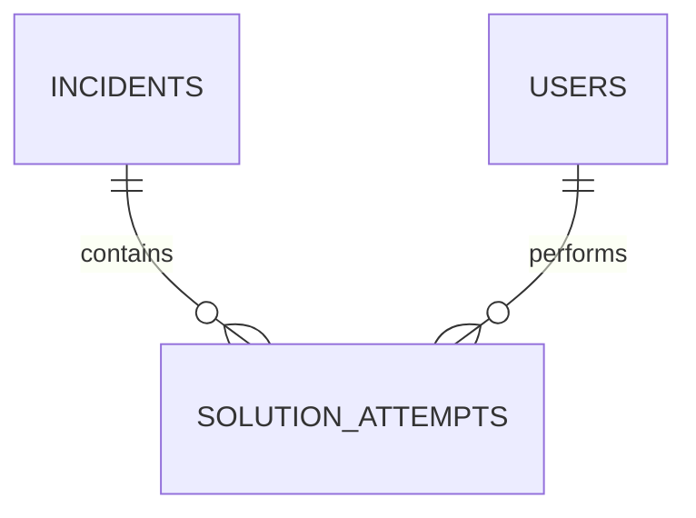

# Database Design — IncidentMind

**Version:** 1.1 | **Status:** Updated

## New Core Table: `solution_attempts`

This table makes outcome-aware memory possible.

| Column | Type | Purpose |
|---|---|---|
| id | UUID | Primary key |
| incident_id | UUID | Related incident |
| solution_text | TEXT | Attempted solution |
| outcome | ENUM | success/failure/partial/rejected/unknown |
| failure_reason | TEXT | Why it failed, when known |
| performed_by | UUID | User or agent |
| execution_duration_ms | INT | Execution duration |
| confidence_at_execution | FLOAT | AI confidence |
| reward_delta | INT | Reward adjustment |
| created_at | TIMESTAMP | Attempt timestamp |

### Relationship



### Critical Rule

**Never overwrite an old solution attempt.** Every new execution creates a new record.

This lets the AI answer:

> What was tried before, and what happened?

### Recommended Indexes
- `solution_attempts.incident_id`
- `solution_attempts.outcome`
- `solution_attempts.created_at`

### Example Query

```sql
SELECT solution_text, outcome, failure_reason,
       confidence_at_execution
FROM solution_attempts
WHERE incident_id = $1
ORDER BY created_at DESC;
```

For similar incidents, retrieval should also include attempts belonging to semantically similar incidents.

### Data Retention

Keep successful and unsuccessful attempts. Archive old records only when required; never remove failed attempts simply because they failed.
