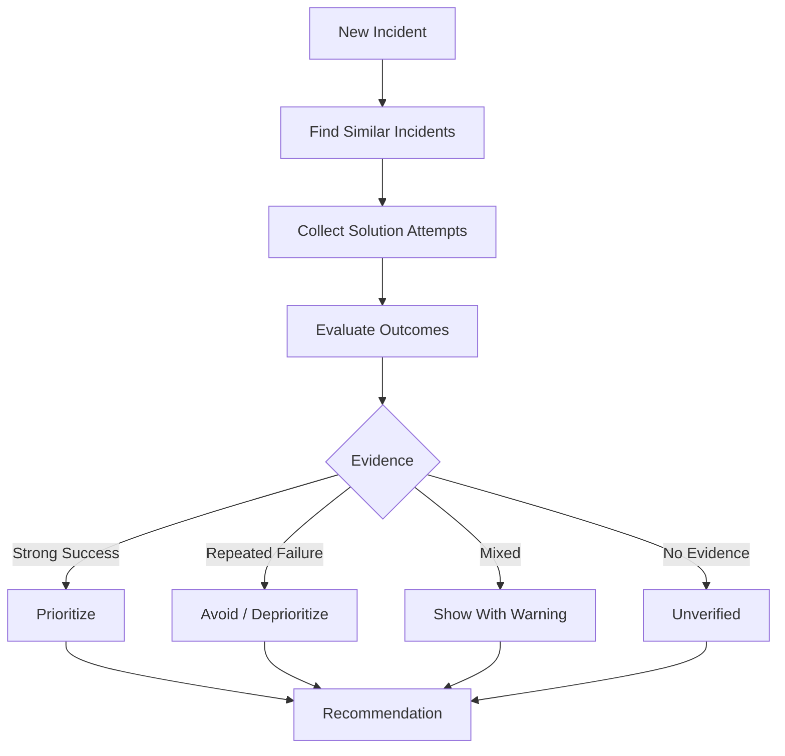

# Feature Specifications — IncidentMind

**Version:** 1.1 | **Status:** Updated

## Outcome-Aware Solution Memory

### Purpose
Remember **both successful and unsuccessful solutions** and use their outcomes when making future recommendations.

### Outcomes

| Outcome | Meaning |
|---|---|
| Success | Fix solved the incident |
| Failure | Fix did not solve it |
| Partial | Fix improved but did not fully resolve it |
| Rejected | Engineer chose not to execute it |
| Unknown | Outcome could not be verified |



### Example
```text
Fix A → ❌ Failed 3 times
Fix B → ⚠️ Partial 1 time
Fix C → ✅ Successful 8 times

AI Recommendation → Fix C
```

**Important:** Failed solutions are never deleted. Failure is valuable memory because it tells the agent what to avoid.

### Global Acceptance Criteria
- Every solution attempt can be recorded.
- Success and failure outcomes are preserved.
- Historical failures influence recommendations.
- AI does not blindly repeat known failed solutions.
- Recommendations include supporting evidence.
